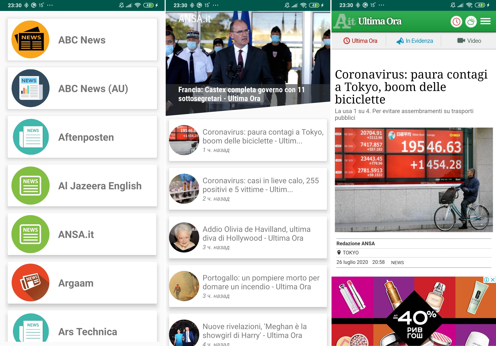

# NewsApp
This is a news application, data for display is obtained through [NewsAPI](https://newsapi.org/). Communication with the network takes place by using Retrofit, data is processed by using Gson, and Picasso library is used to work with images.

The app has three main screens:
* List of sources
* Source news feed
* Displaying specific news

